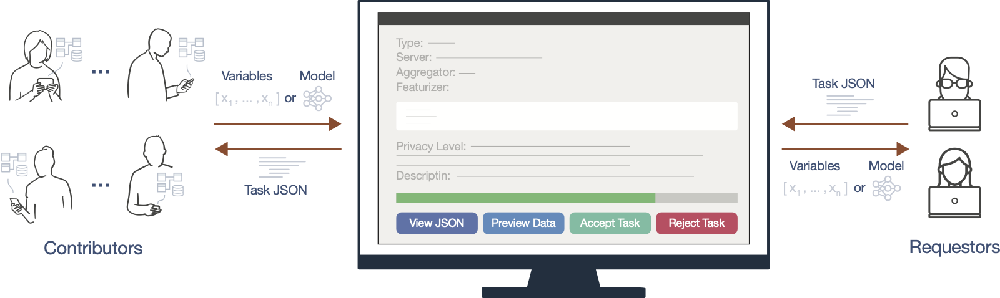
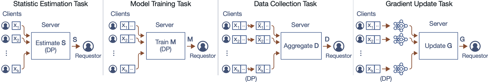

<p align="center">
    <a href="https://dai-lab.github.io/Tiresias/" alt="Documentation">
        </a>
    <a href="https://github.com/DAI-Lab/Tiresias/graphs/contributors" alt="Contributors">
        </a>
    <a href="https://github.com/DAI-Lab/Tiresias/pulse" alt="Activity">
        </a>
</p>

Tiresias is an open source platform for enabling privacy preserving, peer-to-peer, machine learning.

- [Installation](#installation)
- [Quick Start](#quick-start)
    - [Running the Server](#running-the-server)
    - [Running the Client](#running-the-client)
    - [Submitting a Task](#submitting-a-task)
- [Advanced Usage](#advanced-usage)
    - [Exploring Task Types](#exploring-task-types)
    - [Writing Data Collectors](#writing-data-collectors)

***Disclaimer:** Do not use this platform to handle actual user data. This is currently an experimental system for privacy and machine learning research and should not be used in production settings.*

## Installation
To install this library, make sure you are running a supported version of Python and run the following command:

    git clone https://github.com/DAI-Lab/Tiresias
    cd Tiresias
    pip install -e .

To make sure your installation succeeded, you can execute the unit tests by running `pytest`. If all the tests pass, congratulations, you are now ready to start using the Tiresias platform.

## Quick Start
The Tiresias platform consists of a server which is responsible for keeping track of tasks and one or more clients that run on the data contributor's device. When a requestor wants to create a task, they submit it to the server who relays it to the clients; the clients can then choose whether to contribute their data to each task on a case-by-case basis.

<p align="center">
    
</p>

### Running the Server
To launch the `server`, run the following command and specify an open port:

> tiresias-server --port 3000

If you navigate to `http://127.0.0.1:3000/` in your web browser, you'll see a list of open 
tasks. This list will initially be empty - we will demonstrate how you can submit tasks to 
the platform in a later section.

### Running the Client
Now that your platform server is up and running, you can ask your *data contributors* to 
launch the *user client* and point it at your server with the below command.

> tiresias --server http://127.0.0.1:3000/

The *user client* comes with a few built-in dummy datasets that you can play with; however, 
it's up to the *data contributors* to choose what additional data collection applications 
they want to install (i.e. an app that tracks screen time).

The *user client* automatically opens the user interface in your default web browser. The 
user interface will show you any open tasks that you can choose to contribute to, as well 
as a list of the columns that are being collected in your personal data store.

Note that although the user interface is displayed in your web browser, it will not communicate
with the outside world unless you explicitely consent to accepting a task.

### Submitting a Task
Now that you have both the *platform server* and one or more *user clients* up and running, 
we can start writing tasks using the Python API. Here's an example of a basic task which 
estimates the median age of the user:

    from tiresias.server import remote
    task_id = remote.create_task('http://127.0.0.1:3000/', {
        "name": "Median Age",
        "type": "basic",
        "epsilon": 2.0,
        "delta": 1e-5,
        "min_count": 10,
        "featurizer": "SELECT age FROM profile.demographics",
        "aggregator": "median"
    })

The `task_id` is an unique identifier which you can use to check on the status of the query:

    print(remote.fetch_task("http://127.0.0.1:3000/", task_id))

Note that this particular task requires a minimum of 10 users to complete.

## Advanced Usage

### Exploring Task Types

<p align="center">
    
</p>

#### Basic Task
This task would like to access your data by running [SQL]. Your data will be sent to the 
Tiresias server, where it will be combined with at least [COUNT] other users data and 
aggregated into a single [AGGREGATOR] value which will have noise added to make it 
([EPSILON], [DELTA]) differentially private to reduce the risk that anyone can figure out
your contribution to this task. Only this differentially private value will be released to 
the data requester.

```
{
    "type": "basic",
    "epsilon": [FLOAT],
    "delta": [FLOAT],
    "min_count": [INT],
    "featurizer": [SQL],
    "aggregator": [AGGREGATOR]
}
```

#### Integrated Task
This task would like to access your data by running [SQL]. Your data will be sent to the 
Tiresias server, where it will be combined with at least [COUNT] other users data and 
used to train a [MODEL] model to predict [OUTPUT]. This model will have noise added to it 
to make it ([EPSILON], [DELTA]) differentially private to reduce the risk that anyone can 
figure out your contribution to this task. Only this differentially private model will be 
released to the data requester.

```
{
    "type": "integrated",
    "epsilon": [FLOAT],
    "delta": [FLOAT],
    "featurizer": [SQL],
    "model": [MODEL],
    "inputs": [[VARNAME], [VARNAME], ...],
    "output": [VARNAME]
}
```

#### Bounded Task
This task would like to access your data by running [SQL]. Before sending your data to 
the server, we will add noise to make it ([EPSILON], [DELTA]) differentially private to 
reduce the risk that anyone can figure out your contribution to this task.

```
{
    "type": "bounded",
    "epsilon": [FLOAT],
    "delta": [FLOAT],
    "featurizer": [SQL],
    "bounds": {
        "[VARNAME]": {
            "type": "[BOUND_TYPE]",
            "default": [FINITE_VALUE],
            "values": [[FINITE_VALUE], [FINITE_VALUE]],
        }
    }
}
```

#### Gradient Task
This task would like to access your data by running [SQL] and the computing the gradients
for a model. Note that your actual data will not be sent to the server, only the gradients, 
and even then, we add noise to the gradients before sending it to make it ([EPSILON], [DELTA]) 
differentially private to reduce the risk that anyone can figure out your contribution to 
this task.

```
{
    "type": "gradient",
    "epsilon": 10.0,
    "delta": 1e-5,
    "lr": 0.01,
    "min_sample_size": 100,
    "featurizer": "SELECT x1, x2, y FROM profile.example",
    "model": torch.nn.Sequential(
        torch.nn.Linear(2, 10),
        torch.nn.ReLU(),
        torch.nn.Linear(10, 1),
    ),
    "loss": torch.nn.functional.mse_loss,
    "inputs": ["x0", "x1"],
    "output": ["y"],
}
```

### Writing Data Collectors
Coming soon...
